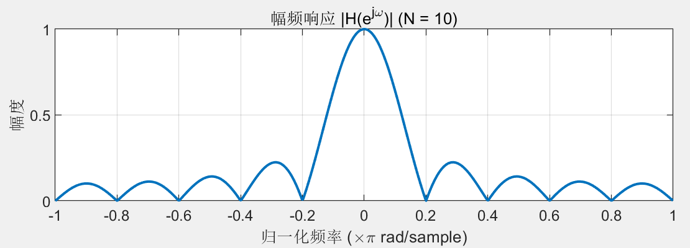
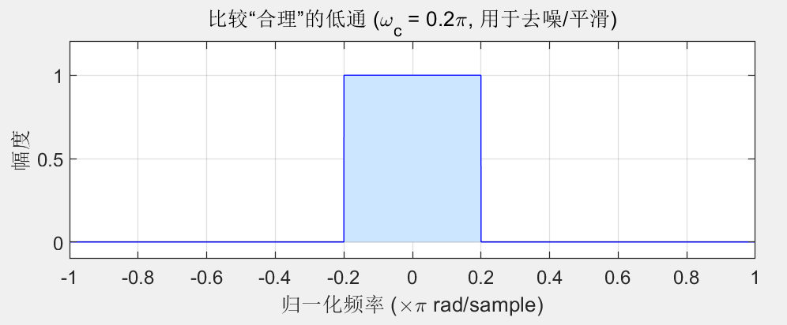

# SMA做为一种低通滤波器的数学证明和缺陷
根据SMA（Simple Moving Average）的定义可以用 **Z变换** 和 **频域响应** 来推导其作为低通滤波器的本质。

以下是数学证明过程。

---

### 1. 时域定义与“窗口”形状

**SMA 在时域上等效于在一个矩形窗（Rectangular Window / Boxcar）内做卷积。**

假设 SMA 的周期为 $N$，输入价格序列为 $x[n]$，输出均线序列为 $y[n]$。
SMA 的定义公式为：
$$y[n] = \frac{1}{N} \sum_{k=0}^{N-1} x[n-k]$$

这是一个典型的 **有限长单位冲激响应（FIR）** 滤波器。我们可以将其写成卷积形式：
$$y[n] = x[n] * h[n]$$

其中 $h[n]$ 是单位冲激响应（Impulse Response）。
    **关于为什么将x[n]是为冲击序列，解释在文档最后，见注解中的q1。**

---

### 2. 频域推导（证明它是低通滤波器）

我们要证明它是低通滤波器，只需要求出它的 **频率响应函数 $H(e^{j\omega})$**，并观察其幅频特性。

#### 第一步：Z变换
根据 FIR 滤波器的定义，对 $h[n]$ 进行 Z 变换：
$$H(z) = \sum_{n=-\infty}^{\infty} h[n] z^{-n} = \sum_{n=0}^{N-1} \frac{1}{N} z^{-n}$$
$$H(z) = \frac{1}{N} (1 + z^{-1} + z^{-2} + ... + z^{-(N-1)})$$

这是一个等比数列求和，公比为 $z^{-1}$，首项为 1，项数为 $N$。利用求和公式：
$$H(z) = \frac{1}{N} \frac{1 - z^{-N}}{1 - z^{-1}}$$

#### 第二步：代入频率 $\omega$
令 $z = e^{j\omega}$（其中 $\omega$ 是归一化角频率，范围 $[0, \pi]$），得到频率响应：
$$H(e^{j\omega}) = \frac{1}{N} \frac{1 - e^{-j\omega N}}{1 - e^{-j\omega}}$$

#### 第三步：欧拉公式变换（关键步骤）
为了提取幅度信息，我们需要利用半角公式技巧提取公因子：
* 分子提取 $e^{-j\omega N/2}$
* 分母提取 $e^{-j\omega/2}$

$$H(e^{j\omega}) = \frac{1}{N} \frac{e^{-j\omega N/2} (e^{j\omega N/2} - e^{-j\omega N/2})}{e^{-j\omega/2} (e^{j\omega/2} - e^{-j\omega/2})}$$

利用欧拉公式 $\sin(\theta) = \frac{e^{j\theta} - e^{-j\theta}}{2j}$，上式变为：
$$H(e^{j\omega}) = \frac{1}{N} \frac{2j \sin(\omega N/2)}{2j \sin(\omega/2)} \cdot e^{-j\omega(N-1)/2}$$

整理后得到最终的频率响应表达式：
$$H(e^{j\omega}) = \underbrace{\frac{1}{N} \frac{\sin(\omega N/2)}{\sin(\omega/2)}}_{\text{幅度项 (Magnitude)}} \cdot \underbrace{e^{-j\omega \frac{N-1}{2}}}_{\text{相位项 (Phase)}}$$

---

### 3. 幅频特性分析

让我们看上面的**幅度项**（取绝对值）：
$$|H(\omega)| = \left| \frac{1}{N} \frac{\sin(\omega N/2)}{\sin(\omega/2)} \right|$$

这个函数就是著名的 **Dirichlet Kernel（狄利克雷核）**，或者通常被称为 **周期性 Sinc 函数 (Periodic Sinc function)**，尽管在 N 很大时它逼近 Sinc 函数。

**证明其为低通滤波器：**

1.  **直流增益 ($\omega \to 0$)：**
    利用洛必达法则：
    $$\lim_{\omega \to 0} |H(\omega)| = \frac{1}{N} \frac{N/2}{1/2} = 1$$
    这意味着：**低频信号（趋势）无损通过。**

2.  **高频衰减：**
    随着 $\omega$ 增大，分子 $\sin(\omega N/2)$ 在 $[-1, 1]$ 震荡，而分母 $\sin(\omega/2)$ 逐渐增大。导致整体幅值呈下降趋势。
    这意味着：**高频信号（噪声）被衰减。**

**结论：** 既然低频通过（增益为1），高频衰减，**得证 SMA 是一个低通滤波器。**
其幅频图像在matlab里画出来如下：
理想的低通滤波器：

---

### 4. 从工程角度看 SMA

虽然 SMA 确实是低通滤波器，但从信号处理角度看，它的性能**非常糟糕**。

#### 问题 A：旁瓣泄露 (Side Lobes)
矩形窗的时域卷积，对应频域的 Sinc 函数卷积。
Sinc 函数具有很强的**旁瓣（Side Lobes）**。
* 这意味着 SMA 对高频噪声的抑制不是单调递减的，而是“反弹”的。某些特定的高频噪声不仅没滤掉，反而可能因为旁瓣效应被保留下来。
* **衰减率差：** 第一旁瓣的衰减只有约 -13dB。作为对比，Hamming 窗或 Blackman 窗能达到 -40dB 甚至更低。

#### 问题 B：不够陡峭 (Slow Roll-off)
理想的低通滤波器应该是上图中那种矩形方方正正的。但 SMA 的过渡带（Transition Band）比较宽。这意味着如果你想滤掉 5 天周期的噪声，你可能不得不连带把 10天周期的趋势也给削弱了。

#### 问题 C：相位滞后 (Phase Lag)
看前面推导的相位项：$-\omega \frac{N-1}{2}$。
这是一个**线性相位**，对应的群延迟（Group Delay）为常数：**（群延时是什么，见注解中的q2）**
$$\tau_g = -\frac{d\phi}{d\omega} = \frac{N-1}{2}$$
这意味着，如果你用 20 日均线 ($N=20$），你的信号平均会比市场**滞后 9.5 天**。

---

## 注解：
### q1：为什么要将输入序列x[n]假定为冲激序列，解释如下：

我们在分析 SMA 时，目的是为了**搞清楚 SMA 这个公式（系统）本身长什么样**，而不是为了算某一天的具体均线值。

想象你面前有一个黑漆漆的山洞（这就是 SMA 系统）：
* **方法 A（正常情况）：** 你对着山洞放一首交响乐（这就是复杂的股价 $x[n]$）。你会听到回声，但因为交响乐太复杂了，你分不清哪些声音是原来的，哪些是山洞的回声。你很难听出山洞的大小和材质。
* **方法 B（冲击响应）：** 你对着山洞**用力拍了一下手**（这就是冲击函数 $\delta[n]$）。
    * 这一下拍手，时间极短，能量集中。
    * 随后你听到的那个拖得长长的回声，**完全就是山洞这个结构造成的**。
    * 这个回声的形状，就描绘了山洞的“长相”。

##### 3. 在 SMA 上的直观演示

一个真实的 **3日移动平均（3-day SMA）** ，为什么输入一个“1”就能看到“矩形窗”。

**SMA 规则：** $y[n] = \frac{x[n] + x[n-1] + x[n-2]}{3}$

假如我们用正常的股价（比如 10, 20, 30...），算出来的结果是一堆数字，你看不出系统的**权重结构**。

现在，我们输入冲击信号 $x = [0, 0, 1, 0, 0, 0, ...]$（假设在第3天出现了价格为1，其他都是0）：

* **第1天 ($x=0$)：** $\text{Avg} = (0+0+0)/3 = 0$
* **第2天 ($x=0$)：** $\text{Avg} = (0+0+0)/3 = 0$
* **第3天 ($x=1$)：** $\text{Avg} = (1+0+0)/3 = \mathbf{0.33}$  $\leftarrow$ 冲击进入
* **第4天 ($x=0$)：** $\text{Avg} = (0+1+0)/3 = \mathbf{0.33}$
* **第5天 ($x=0$)：** $\text{Avg} = (0+0+1)/3 = \mathbf{0.33}$
* **第6天 ($x=0$)：** $\text{Avg} = (0+0+0)/3 = 0$     $\leftarrow$ 冲击滑出

**序列 $y[n]$ 变成了**
 $[0, 0, \mathbf{0.33, 0.33, 0.33}, 0, ...]$

这三个连着的 $0.33$，这是一个**平顶的矩形**

### q2：群时延是什么？
想象一个由很多不同频率的正弦波组成的“波包”（Wave Packet，你可以把它看作一段K线的形态）。

相延迟 (Phase Delay)： 描述的是每个独立的单频正弦波滞后了多少。

群延迟 (Group Delay)： 描述的是这个波包的“包络”（Envelope）整体滞后了多少。

通俗类比： 一群人（各种频率分量）坐大巴车去终点。

群延迟就是这辆大巴车（整体波形）比预定时间晚到了多久。

